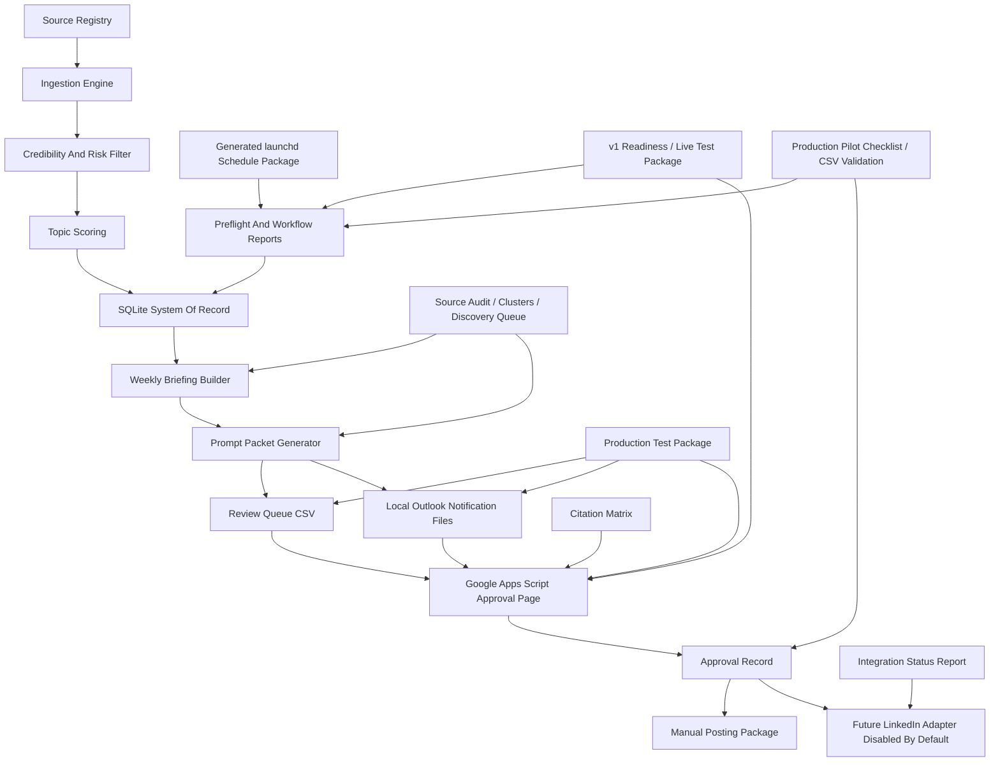

# Architecture

## Components

- SQLite is the source of truth.
- YAML stores configuration and safety policy.
- Markdown prompt packets support no-API drafting.
- Google Sheets CSV export supports mobile review without Python Google credentials.
- Local notification packages create Outlook-copyable text and HTML files without Microsoft Graph.
- Integration status reports which optional adapters are available, disabled, or blocked by Cost Guard.
- Preflight checks and local workflow reports make daily and Friday runs repeatable.
- Source governance audits, topic clusters, discovery queue files, and citation matrices improve recommendation quality without model/API calls.
- v1 readiness and live-test package commands consolidate preflight, approval QA, deployment files, and pilot runbook.
- Production pilot reports, checklist state, and review queue CSV validation harden the first real operating week.
- Production test packages create the selected topic, draft, approval packet, notification files, ReviewQueue CSV, validation report, and runbook needed for first-post testing.
- The schedule package creates launchd plist files only; it does not install or load jobs.
- LinkedIn API publishing is scaffolded only and disabled by default.

## Safety Gates

- Cost Guard blocks paid-capable providers in Hard Zero Mode.
- Approval records must match draft ID, version, and content hash.
- Exported Google Sheet rows are validated before import.
- Media approval is separate from text approval.
- Publishing remains assisted manual unless explicitly enabled later.
- Approval packets include citation matrix summary counts for draft/source support.
- Google Sheets API write-back, Microsoft Graph email sending, paid model providers, media generation, and LinkedIn API publishing stay disabled in Hard Zero Mode.
